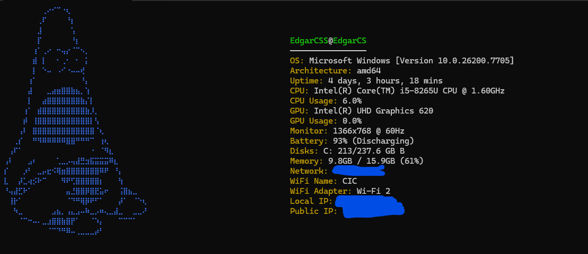

# GoFetch

A lightweight system information utility for Windows, built with Go. GoFetch displays comprehensive real-time information about your computer's hardware and network status with an elegant ASCII art interface.



## What is GoFetch?

GoFetch is a minimalist command-line tool that fetches and displays system information in real-time. It provides a beautiful, color-coded interface that updates continuously, giving you instant insights into your system's performance and configuration.

## Features

- **Real-time Monitoring**: Continuous updates of CPU, memory, and network information
- **Comprehensive System Information**:
  - CPU name and real-time usage
  - GPU name and real-time usage
  - Memory (RAM) usage
  - Network information (Local IP and Public IP)
  - WiFi name and adapter details
  - Monitor information
  - Battery status
  - Disk information
- **Beautiful ASCII Interface**: Styled banner with ANSI color support
- **Windows Optimized**: Direct integration with Windows APIs for accurate system data
- **Lightweight**: Minimal dependencies and low resource consumption

## What It Shows

GoFetch displays the following information on your terminal:

- **System Identity**: Username and hostname
- **CPU**: Name, model, and real-time usage percentage
- **GPU**: Video card information and real-time usage
- **Memory**: Available and total RAM with usage percentage
- **Network**: Local IP address, public IP address
- **WiFi**: Connected network name and adapter information
- **Monitor**: Display resolution and refresh rate information
- **Battery**: Current charge level and status
- **Disk Information**: Storage drives and their capacity

## Installation

### Requirements
- **Windows OS** (Vista or later)
- **Go 1.25.4 or higher**

### Steps

1. **Clone the repository**:
   ```bash
   git clone https://github.com/yourusername/GoFetch.git
   cd GoFetch
   ```

2. **Install dependencies**:
   ```bash
   go mod download
   ```

3. **Build the executable**:
   ```bash
   go build -o GoFetch.exe
   ```

## How to Run

### Option 1: Direct execution (requires Go installed)
```bash
go run main.go
```

### Option 2: Run the compiled executable
```bash
./GoFetch.exe
```

### Option 3: Add to PATH
Move `GoFetch.exe` to a folder in your PATH for global access:
```bash
# Example: Copy to System32
copy GoFetch.exe C:\Windows\System32\
```

Then run from anywhere:
```bash
GoFetch
```

## ⚠️ Note on Networking Functions

Please be aware that **networking functions (IP fetching and WiFi detection) may be slower than expected** due to limited options available in Go for Windows network interfaces. The application makes API calls to external services and system APIs which can introduce minor delays in updating network information. This is a known limitation and does not affect the reliability of the data, only the refresh speed of network-related information.

## Dependencies

- `golang.org/x/sys v0.40.0` - For Windows system-level operations

## Technical Details

- **Language**: Go (Golang)
- **Platform**: Windows
- **Terminal Compatibility**: Supports ANSI color codes (Windows 10+)
- **Update Frequency**: 33ms refresh rate for smooth display updates

## License

[Add your license here]

## Contributing

Feel free to submit issues, fork the repository, and create pull requests for any improvements.

## Author

[Your Name/GitHub]

---

**Note**: GoFetch requires administrator privileges for some system information queries on older Windows versions.
